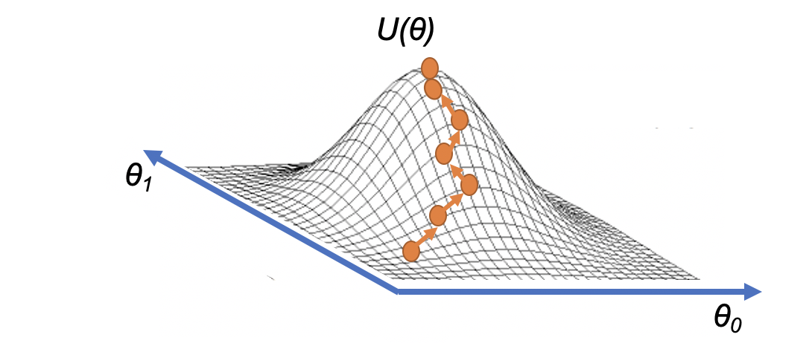

Directory to blog/technical writings on various topics I find interesting. Some of these have been based on assignments/reports that I enjoyed and learned a lot from; others are based on courses I have taken, or research I have done.

---
### [Reinforcement Learning for Control Systems](Reinforcement Learning  for Control Systems.pdf)

This is a final report that I completed for my [Mathematical Foundations of Data Science](https://mdav.ece.gatech.edu/ece-4803-fall2020/) course. In this I explore the intersection of reinforcement learning and control systems, and apply basic optimal policy estimation techniques. I apply this to an inverted cart pendulum and reformulate the Linear Quadratic Regulator (LQR) control problem as a reinforcement learning problem in order to **learn** the optimal LQR gains in a "model-free" Matlab experiment/simulation. [See accompanying presentation slides.](Reinforcement Learning  for Control Systems presentation.pdf)

---
### [The Imminent Challenges of Autonomous Vehicles and How To Ethically Address Them]()

This is a final white paper that I completed for my INTA 2030 International Affairs course where we focused on the ethical aspects of various new technologies being used and incorporated into society. My white paper was on the topic of Autonomous Vehicle (AV) technology. This white paper introduces the autonomous vehicle industry and various self-driving technologies. I then explore various societal implications and ethical dilemmas that autonomous vehicles will bring in the future, and propose guidelines to regulate and govern the AV industry in order to ensure that these technologies are ethical. [See accompanying presentation slides.](The Imminent Challenges of Autonomous Vehicles and How To Ethically Address Them.pdf)

---
### [Differential Dynamic Programming (DDP) and Model Predictive Control (MPC)]()